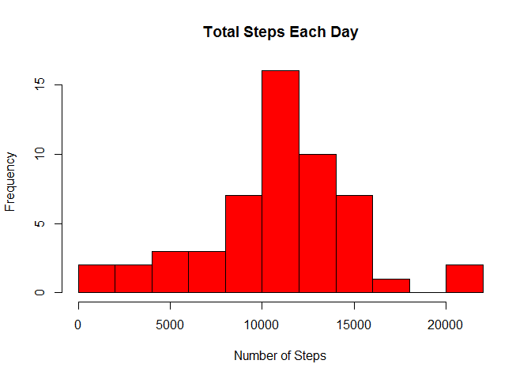
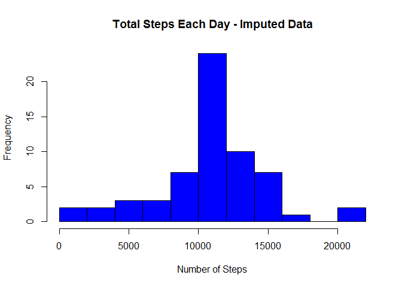

Activity Monitoring Data
========================

Loading and preprocessing the data
----------------------------------

         activity<-read.csv("activity.csv")

What is mean total number of steps taken per day?
-------------------------------------------------

#### Make a histogram of the total number of steps taken each day

           total_steps <- aggregate(steps ~ date, activity, sum)
           hist(total_steps$steps, breaks=10, main = "Total Steps Each Day", col="red", xlab="Number of Steps")

#### Calculate and report the mean and median total number of steps taken per day

           options(scipen=999,digits=2)
           step_mean <- mean(total_steps$steps)
           step_median <- median(total_steps$steps)

    Mean total number of steps taken per day = 10766.19
    Median total number of steps taken per day = 10765

What is the average daily activity pattern?
-------------------------------------------

#### Make a time series plot of the 5-minute interval and the average number of steps taken, averaged across all days

           interval_steps <- aggregate(steps ~ interval, activity, mean)
           plot(interval_steps$interval,interval_steps$steps, type="l", xlab="Interval", ylab="Number of Steps",main="Average Number of Steps per Day by Interval")

#### Which 5-minute interval, on average across all the days in the dataset, contains the maximum number of steps?

           interval_max <- interval_steps[which.max(interval_steps$steps),1]

    5-min interval with maximum number of steps = 835

Imputing missing values
-----------------------

#### Calculate and report the total number of missing values in the dataset

           missing_val <- sum(is.na(activity$steps))

#### Devise a strategy for filling in all of the missing values in the dataset

The strategy for filling consist in replace NA by the average of this
interval where NA is located

           activity2 <- transform(activity, steps = ifelse(is.na(activity$steps), interval_steps$steps[match(activity$interval, interval_steps$interval)], activity$steps))

#### Create a new dataset that is equal to the original dataset but with the missing data filled in

           total_steps2 <- aggregate(steps ~ date, activity2, sum)
           step_mean2 <- mean(total_steps2$steps)
           step_median2 <- median(total_steps2$steps)
           interval_steps2 <- aggregate(steps ~ interval, activity2, mean)
           interval_max2 <- interval_steps2[which.max(interval_steps2$steps),1]

Values for imputed data are:  
·New mean total steps = 10766.19  
·New median total steps = 10766.19  
·New interval with maximum number of steps = 835

#### Make a histogram of the total number of steps taken each day and Calculate and report the mean and median total number of steps taken per day

           hist(total_steps2$steps, breaks=10, main = "Total Steps Each Day - Imputed Data", col="blue", xlab="Number of Steps")

#### What is the impact of imputing missing data on the estimates of the total daily number of steps?

           options(scipen=999,digits=2)
           diff_steps <- sum(total_steps2$steps) - sum(total_steps$steps)

Difference for total daily number of steps = 86129.51

Are there differences in activity patterns between weekdays and weekends?
-------------------------------------------------------------------------

#### Create a new factor variable in the dataset with two levels -- "weekday" and "weekend"

           w_day <- weekdays(as.Date(activity2$date))
           select <- ifelse (w_day == "sábado" | w_day == "domingo", "weekend", "weekday")
           activity2$wk <- as.factor(select)

#### Make a panel plot containing a time series plot of the 5-minute interval and the average number of steps taken, averaged across all weekday days or weekend days

           library(lattice)
           dataplot <- aggregate(steps ~ wk+interval, data=activity2, FUN=mean)
           xyplot(steps ~ interval | factor(wk),
                  layout = c(1, 2),
                  xlab="Interval",
                  ylab="Number of steps",
                  type="l",
                  lty=1,
                  data=dataplot)

